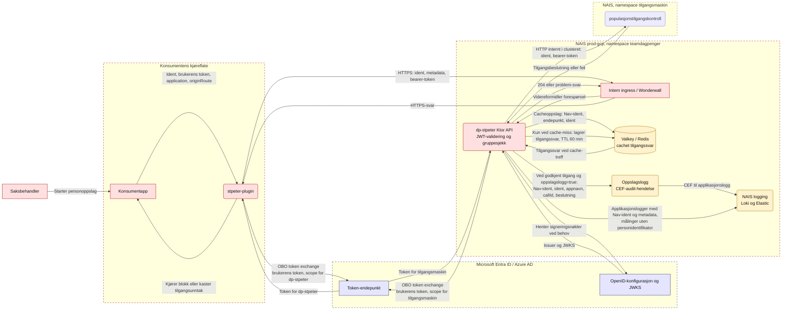

# Dataflytdiagram for trusselmodellering

Diagrammet viser dataflyten for `POST /api/v1/person` i prod. `stpeter-plugin` kjører inne i konsumentappen. Stiplede rammer viser tillitsgrenser, og pilene beskriver dataene som krysser dem.

## Data i flyten

| Data | Klassifisering | Hvor dataene går |
|---|---|---|
| Fødselsnummer eller annen personidentifikator | Strengt fortrolig | Konsumentapp, plugin, API, tilgangsmaskin og cache-nøkkel |
| Saksbehandlerens Nav-ident | Fortrolig | Token-claims, cache-nøkkel og oppslagslogg |
| Tilgangsbeslutning og svar fra tilgangsmaskin | Fortrolig | API, cache og konsumentapp som problem-svar ved avslag |
| Bearer-token og OBO-token | Hemmelig autentiseringsdata | Plugin/API, Azure AD og tilgangsmaskin; skal ikke logges eller caches |
| `application`, `originRoute` og `callId` | Intern metadata | Konsumentapp og API logger metadata; oppslagsloggen tar med appnavn og callId |

## Tillitsgrenser og merknader

- Konsumentappen må være eksplisitt tillatt av ingressens og NAIS `accessPolicy`-regler. Kontroller prod-reglene i `.nais/nais.yaml` før du bruker diagrammet som grunnlag for godkjenning.
- API-et validerer signatur, issuer, audience og saksbehandlergruppe før det behandler forespørselen.
- Kallet fra `dp-stpeter` til tilgangsmaskin bruker HTTP i clusteret, slik `TILGANGSMASKIN_API_URL` i manifestet angir. Behandle dette som en nettverkstillitsgrense, og bekreft transportbeskyttelsen mot gjeldende plattformkrav.
- Cache-nøkkelen inneholder Nav-ident og personidentifikator. Cacheinnholdet har tilgangssvar og utløper etter 60 minutter.
- Oppslagsloggen registrerer bare godkjente oppslag når konsumenten ber om det. CEF-hendelsen inneholder Nav-ident, personidentifikator, appnavn, callId og beslutningen «Permit». Applikasjonsloggene inneholder Nav-ident og forespørselsmetadata.
- `allowAllUsers: true` i Azure-oppsettet erstatter ikke API-ets saksbehandlergruppesjekk.
